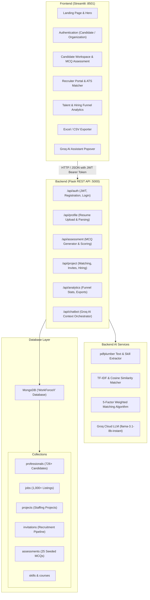

# WorkForceX

## AI-Powered Workforce Liquidity & Project Staffing Platform

[](LICENSE)
[](https://www.python.org/)
[](https://flask.palletsprojects.com/)
[](https://streamlit.io/)
[](https://www.mongodb.com/)

**WorkForceX** is an end-to-end workforce liquidity platform engineered to eliminate friction between organizational staffing demand and deployment-ready talent. Rather than treating talent acquisition as a slow, reactive recruitment process, WorkForceX operates as a real-time liquidity system: validating skills through domain-specific assessments, scoring candidates via multi-factor weighted matching, and assembling project teams on demand.

The platform provides dual dedicated portals for **Candidates / Professionals** and **Organizations / Recruiters**, powered by a **Flask REST API**, a modern **Streamlit** dark-mode user interface, **MongoDB** document storage (supporting both remote Atlas and bundled local portable MongoDB), and a **Groq-powered LLM assistant**.

---

## Table of Contents

- [WorkForceX](#workforcex)
  - [AI-Powered Workforce Liquidity \& Project Staffing Platform](#ai-powered-workforce-liquidity--project-staffing-platform)
  - [Table of Contents](#table-of-contents)
  - [Problem Statement \& Value Proposition](#problem-statement--value-proposition)
  - [Key Features](#key-features)
    - [Verified \& Implemented Features](#verified--implemented-features)
    - [Partial \& Planned Features](#partial--planned-features)
  - [Application Architecture \& Visual Walkthrough](#application-architecture--visual-walkthrough)
  - [Technology Stack](#technology-stack)
  - [Repository Structure](#repository-structure)
  - [Prerequisites](#prerequisites)
  - [Installation and Setup](#installation-and-setup)
  - [Environment Variables \& Configuration](#environment-variables--configuration)
  - [Database Setup \& Portable MongoDB Engine](#database-setup--portable-mongodb-engine)
  - [How to Run the Application](#how-to-run-the-application)
  - [Seed Accounts for Testing \& Walkthrough](#seed-accounts-for-testing--walkthrough)
    - [1. Candidate Portal Login](#1-candidate-portal-login)
    - [2. Recruiter / HR Portal Login](#2-recruiter--hr-portal-login)
  - [Application Workflow](#application-workflow)
    - [Professional Journey](#professional-journey)
    - [Organization Journey](#organization-journey)
  - [Testing and Validation](#testing-and-validation)
  - [Known Limitations](#known-limitations)
  - [Future Roadmap](#future-roadmap)
  - [Project Team](#project-team)
  - [License](#license)

---

## Problem Statement & Value Proposition

Traditional recruitment is fraught with friction:
- **Prolonged Time-to-Fill**: Organizations face weeks of screening delays when scaling project headcounts.
- **Unverified Resumes**: Self-reported resumes frequently overstate capabilities, causing delivery bottlenecks.
- **Talent Inaccessibility**: Qualified, deployment-ready talent often remains idle due to disconnected discovery channels.

WorkForceX solves this by creating a structured liquidity pipeline:
1. **Dynamic Resume Parsing & TF-IDF Semantic Role Matching**: Uploaded PDF resumes are parsed, extracting skills, education, and years of experience, comparing text against standard role profiles via cosine similarity.
2. **Objective Skill Verification**: Candidates must complete domain-specific MCQ assessments (minimum 60% passing threshold) before becoming "Deployment Ready".
3. **5-Factor Weighted Candidate Matching**: Recruiters match open multi-role projects against candidate inventory using a transparent, multi-dimensional scoring algorithm.
4. **Instant Invitation & Hiring**: Streamlined lifecycle from invitation dispatch to candidate acceptance and final hiring.

---

## Key Features

### Verified & Implemented Features

| Feature | Category | Implementation Details |
| :--- | :--- | :--- |
| **PDF Resume Parsing & AI Scoring** | Candidate Portal | Text extraction using `pdfplumber`, keyword matching against MongoDB skills inventory, TF-IDF cosine similarity for career role recommendation, and automatic score calculation (Resume Score 0–100, Readiness Index). |
| **Domain-Specific MCQ Assessments** | Candidate Portal | Real-time question generation across 5 domains (Data Analyst, Machine Learning, Python, SQL, Cybersecurity) with 3 difficulty tiers (Easy, Medium, Hard). Enforces max 3 attempts; passing unlocks **Deployment Ready** badge. |
| **Career Progress Timeline** | Candidate Portal | Real-time horizontal milestone tracker reflecting 9 status stages (`Registered` &rarr; `Resume Uploaded` &rarr; `Resume Analyzed` &rarr; `Skills Extracted` &rarr; `Assessment Completed` &rarr; `Deployment Ready` &rarr; `Invitation Received` &rarr; `Invitation Accepted` &rarr; `Hired` / `Working on Project`). |
| **Interactive Profile Management** | Candidate Portal | Editable profile details, experience levels, state locations, multi-select skills with comma-separated custom tag additions, and spoken language preferences. |
| **Project Invitation Inbox** | Candidate Portal | Real-time inbox for corporate project invitations with one-click Accept or Decline actions. |
| **Unlockable Career Roadmap** | Candidate Portal | If candidate fails 3 assessment attempts, portal locks and displays a structured 4-week recovery roadmap with curated certification links. |
| **Multi-Role Project Launcher** | Recruiter Portal | Create projects specifying client, department, budget, timeline, priority, work mode, and breakdown across multiple role slots (each with custom headcount, experience, and skills). |
| **5-Factor AI Matching Engine** | Recruiter Portal | Weighted algorithm: **30% Resume Score**, **25% Assessment Score**, **25% Tokenized Skill Match**, **10% Experience Match**, and **10% Certifications**. Includes primary-skill penalty gates and multi-role best-fit slot routing. |
| **Interactive ATS Candidate View** | Recruiter Portal | Deep-dive modal inspecting candidate personal details, skills, education, experience, match score breakdown, and strengths/weaknesses. |
| **Candidate Rejection / Pass Engine** | Recruiter Portal | Passing a candidate removes them from current matches, logs the decision, and surfaces the next highest-scoring candidate automatically. |
| **Direct Invitation & Hiring Cycle** | Recruiter Portal | Send direct invitations; candidates review and accept; recruiter clicks **Hire Candidate** to decrement open vacancies and transition project to **Project Active**. |
| **Recruitment Analytics Dashboard** | System Analytics | Real-time Altair charts tracking hiring funnel drop-offs, resume score distribution, top 10 skills in demand, and domain distribution directly from MongoDB collections. |
| **Multi-Format Report Exporter** | Reports | Export candidate profile rosters, project staffing summaries, hiring/invitation logs, and assessment attempts to **Microsoft Excel (.xlsx)** or **CSV**. |
| **Context-Aware AI Assistant** | Chatbot | Floating chatbot widget powered by Groq (`llama-3.1-8b-instant`). Dynamically shifts persona between **Recruiter Assistant** and **Career Coach**, reading live database context to answer page-specific queries. |
| **Self-Contained Portable Engine** | DevOps / Platform | Single launcher (`python app.py`) that manages MongoDB (local portable or cloud Atlas), seeds baseline data, starts the Flask API, launches Streamlit, and opens the browser. |

### Partial & Planned Features

To maintain transparency between current implementation and future vision:
- **Workforce Continuity Engine (Automated Attrition Replacement)**: *Partially Implemented*. Currently handled by recruiters passing/rejecting candidates to dynamically surface the next match; automated AI replacement triggered by attrition events is planned for a subsequent release.
- **Smart Team Builder Combinatorics**: *Partially Implemented*. Multi-role headcount breakdown and individual role-slot matching are implemented; automated combinatorial team optimization based on interpersonal synergy is planned.
- **Predictive Labor Demand Forecasting**: *Planned*. Current analytics reflect real-time MongoDB aggregations and dataset distributions; predictive ML time-series forecasting for upcoming quarter talent shortages is on the roadmap.
- **Verifiable Candidate Passport**: *Planned*. Candidate assessment results and history are tracked in MongoDB and exportable via reports; decentralized cryptographic/blockchain credentials represent future enhancements.

---

## Application Architecture & Visual Walkthrough



### Visual Assets

The landing page incorporates visual hero assets located in [`frontend/assets/recruitment_hero.jpg`](frontend/assets/recruitment_hero.jpg), featuring a responsive two-column layout with dark glassmorphism aesthetic styling.

---

## Technology Stack

- **Backend Framework**: [Flask 3.1](https://flask.palletsprojects.com/) with [Flask-CORS](https://flask-cors.readthedocs.io/)
- **Frontend Framework**: [Streamlit 1.59](https://streamlit.io/) with responsive query parameter routing and custom CSS glassmorphism styles
- **Database**: [MongoDB 7.0](https://www.mongodb.com/) via [PyMongo 4.17](https://pymongo.readthedocs.io/) (supports local portable `mongod.exe` v7.0.12 and remote MongoDB Atlas)
- **AI & NLP**:
  - `scikit-learn`: TF-IDF vectorization and cosine similarity for role recommendation
  - `groq`: Llama 3.1 8B Instant LLM orchestration for context-aware conversational assistance
  - `pdfplumber`: PDF resume text extraction and structural parsing
- **Data Analytics & Visualizations**: [Pandas 3.0](https://pandas.pydata.org/), [NumPy](https://numpy.org/), [Altair](https://altair-viz.github.io/)
- **Security & Authentication**: [PyJWT](https://pyjwt.readthedocs.io/) (HMAC-SHA256 tokens), [bcrypt](https://github.com/pyca/bcrypt/) password hashing
- **Report Generation**: [OpenPyXL](https://openpyxl.readthedocs.io/) (Excel `.xlsx` streaming) and standard CSV streaming

---

## Repository Structure

```text
WorkForceX
│
├── backend/                            # Flask REST API & Core Services
│   ├── database/
│   │   └── mongo.py                    # MongoDB singleton connection manager
│   ├── routes/
│   │   ├── analytics_routes.py         # Hiring funnel, KPIs, notifications & export endpoints
│   │   ├── assessment_routes.py        # MCQ question generator, attempt validation & grading
│   │   ├── auth_routes.py              # Candidate & Organization registration, login, JWT
│   │   ├── chatbot_routes.py           # Context-injected AI chat routing
│   │   ├── profile_routes.py           # Resume upload, parsing & candidate profile updates
│   │   └── project_routes.py           # Multi-role project creation, candidate matching & ATS
│   ├── services/
│   │   ├── auth_service.py             # Password hashing (bcrypt) & JWT token encoding/decoding
│   │   ├── chatbot_service.py          # Groq API integration (Llama 3.1) with persona injection
│   │   ├── matching_service.py         # 5-factor weighted algorithm & multi-role slot assignment
│   │   ├── resume_analyzer.py          # TF-IDF semantic role recommendations & score evaluation
│   │   └── resume_parser.py            # PDF resume text extraction & keyword skill recognition
│   ├── utils/
│   │   └── helpers.py                  # Token-required role-based route decorator
│   ├── config.py                       # Application configuration & safe environment fallbacks
│   └── requirements.txt                # Backend and core dependencies
│
├── frontend/                           # Streamlit Web Application
│   ├── api/
│   │   └── client.py                   # Centralized HTTP client communicating with Flask API
│   ├── assets/
│   │   └── recruitment_hero.jpg        # Landing page hero visual illustration
│   ├── components/
│   │   └── ui.py                       # Reusable UI cards, KPI metrics, and career timeline
│   ├── styles/
│   │   └── custom.css                  # Custom styling (glassmorphism, glow buttons, cards)
│   ├── views/
│   │   ├── analytics_page.py           # Talent analytics, hiring funnel & skill charts
│   │   ├── auth_page.py                # Landing page, dual-portal selector & registration forms
│   │   ├── organization_dashboard.py   # Multi-role project management, AI matcher & invitation manager
│   │   ├── professional_dashboard.py   # Candidate workspace, resume uploader & MCQ test interface
│   │   └── reports_page.py             # Excel (.xlsx) and CSV report export interface
│   └── streamlit_app.py                # Main Streamlit application entry point & session router
│
├── datasets/                           # Cleaned and Preprocessed Datasets
│   ├── AI_Resume_Screening_Cleaned.csv # 726 resumes with skills, experience, and baseline AI scores
│   └── indian-job-market-dataset-2025_Preprocessed.csv # 36,676 real-world Indian job listings
│
├── mongodb-portable/                   # Local portable MongoDB v7.0.12 (Windows x86_64)
│   ├── bin/mongod.exe                  # Standalone MongoDB database daemon
│   └── data/                           # Local database storage directory
│
├── mongodb_loader/                     # Seeding & Portable Database Setup
│   ├── download_mongo.py               # Automated script to fetch portable MongoDB binary if absent
│   └── load_datasets.py                # Cleans and seeds CSV datasets, default users & MCQs into MongoDB
│
├── app.py                              # Master one-click platform orchestrator
├── requirements.txt                    # Root dependency file pointing to backend requirements
├── .env.example                        # Template for environment variables with safe placeholders
├── .gitignore                          # Configured Git exclusions (secrets, logs, caches)
├── LICENSE                             # MIT License
└── README.md                           # Comprehensive project documentation
```

---

## Prerequisites

- **Python**: Version 3.10, 3.11, or 3.12 (64-bit recommended)
- **Operating System**: Windows (fully supported out of the box with bundled portable MongoDB), Linux, or macOS (using a local or Atlas MongoDB connection)
- **MongoDB**: Bundled locally in `mongodb-portable/bin/mongod.exe` for Windows, or an external MongoDB instance / MongoDB Atlas URI

---

## Installation and Setup

1. **Clone the Repository**:
   ```bash
   git clone https://github.com/thirilose-learn/workforce-project.git
   cd workforce-project
   ```

2. **Create and Activate a Virtual Environment**:
   ```bash
   # Windows
   python -m venv .venv
   .venv\Scripts\activate

   # Linux / macOS
   python3 -m venv .venv
   source .venv/bin/activate
   ```

3. **Install Dependencies**:
   ```bash
   pip install -r requirements.txt
   ```

---

## Environment Variables & Configuration

WorkForceX supports automatic configuration fallback. For custom configurations, create a `.env` file in the root workspace directory based on `.env.example`:

```bash
cp .env.example .env
```

### Environment Parameters

| Variable | Description | Default / Example Value |
| :--- | :--- | :--- |
| `MONGO_URI` | MongoDB connection string (local or cloud) | `mongodb://127.0.0.1:27017` |
| `JWT_SECRET` | Secret key for signing authentication tokens | `your_jwt_secret_key_here` |
| `GROQ_API_KEY` | *(Optional)* Groq Cloud API key for AI Chatbot | `gsk_...` (from [Groq Console](https://console.groq.com)) |
| `UPLOAD_FOLDER` | *(Optional)* Storage path for uploaded resumes | `backend/uploads` |

> [!NOTE]
> If `GROQ_API_KEY` is not provided, all recruitment, matching, scoring, and assessment features remain fully operational; the floating chatbot popover will display an informative setup notice.

---

## Database Setup & Portable MongoDB Engine

WorkForceX includes self-contained database handling:

1. **Local Portable MongoDB (Windows)**:
   The workspace includes a portable MongoDB binary located at `mongodb-portable/bin/mongod.exe`. When launched via `app.py`, the system checks port `27017` and starts the local server automatically if not already active.
2. **Database Seeding**:
   The database loader (`mongodb_loader/load_datasets.py`) seeds:
   - **726 candidate profiles** into the `professionals` collection from `datasets/AI_Resume_Screening_Cleaned.csv`
   - **1,000 job listings** into `jobs` from `datasets/indian-job-market-dataset-2025_Preprocessed.csv`
   - **25 domain-specific MCQs** across 5 technical disciplines
   - **2 corporate accounts** (`TechCorp Solutions` and `Innovate Analytics`)
   - Pre-configured skills and career course recommendations
3. **Manual Seeding (Optional)**:
   If you wish to re-seed the database manually at any time:
   ```bash
   python mongodb_loader/load_datasets.py
   ```

---

## How to Run the Application

The simplest and recommended way to start the entire WorkForceX suite is via the master orchestrator:

```bash
python app.py
```

This single command:
1. Validates the MongoDB connection (starts the local portable server on port 27017 if necessary).
2. Verifies that baseline datasets are populated.
3. Launches the Flask REST API on `http://localhost:5000`.
4. Launches the Streamlit Web Application on `http://localhost:8501`.
5. Opens your default web browser directly to `http://localhost:8501`.

To shut down all services cleanly, press `Ctrl+C` in the terminal.

### Running Backend and Frontend Individually (Alternative)

If you prefer to run services in separate terminal tabs:

- **Terminal 1 (Backend API)**:
  ```bash
  python backend/app.py
  ```
- **Terminal 2 (Frontend App)**:
  ```bash
  streamlit run frontend/streamlit_app.py
  ```

---

## Seed Accounts for Testing & Walkthrough

The platform includes pre-configured accounts designed for an end-to-end evaluation of the recruitment cycle:

### 1. Candidate Portal Login
- **Portal**: Select **Candidate Portal**
- **Username / Email**: `wesleyroman2@workforcex.com`
- **Password**: `password123`
- **Recommended Workflow**:
  1. Inspect the parsed Resume Score and Readiness Index.
  2. Navigate to **Skill MCQ Assessment**.
  3. Answer the technical questions and submit to achieve **Deployment Ready** status.
  4. Edit profile details or skills in the **Edit Profile Details** panel.
  5. Check **Project Invitations** to review and accept incoming corporate offers.

### 2. Recruiter / HR Portal Login
- **Portal**: Select **Organization Portal**
- **Username / Email**: `hr@techcorp.com` (or username `techcorp`)
- **Password**: `password123`
- **Recommended Workflow**:
  1. Navigate to **Create New Project** and create a project (e.g. *AI Analytics Platform* with a *Data Scientist* role slot).
  2. In **Projects & AI Match**, select the project to view AI-ranked candidates.
  3. Click **View Candidate Profile** on a candidate (e.g. *Wesley Roman*) to review their ATS card.
  4. Click **Send Invitation**.
  5. Once the candidate accepts in their portal, click **Hire Candidate** to fill the staffing slot.
  6. Review system-wide metrics in **System Analytics** and export data via **Reports Exporter**.

---

## Application Workflow

### Professional Journey

```text
[Registration / Login] ──> [Upload PDF Resume] ──> [AI Resume Scoring & TF-IDF Role Match]
                                                              │
                                                              ▼
[Hired / Deployed] <── [Accept Invite] <── [Deployment Ready] <── [Take Domain MCQ Test (>=60%)]
                                                              │ (Failed 3x)
                                                              ▼
                                               [Unlock Career Guidance Roadmap]
```

### Organization Journey

```text
[HR Login] ──> [Create Multi-Role Project] ──> [Run 5-Factor AI Matcher]
                                                          │
                                                          ▼
[Active Project] <── [Hire Candidate] <── [Candidate Accepts] <── [Send Project Invite]
                                                          │ (or Reject/Pass)
                                                          ▼
                                            [Next Top Candidate Surfaced]
```

---

## Testing and Validation

The repository includes both unit matching tests and end-to-end integration workflows.

### 1. Verification of Code Syntax
Verify that all source modules compile with zero errors:
```bash
python -m py_compile app.py backend/app.py backend/config.py frontend/streamlit_app.py
```

### 2. Smart Matching Algorithm Test
Validates multi-role project creation, weighted candidate ranking, and dynamic candidate rejection/replacement:
```bash
python backend/tests/test_smart_matching.py
```

### 3. End-to-End Recruitment Cycle Test
Validates professional login, MCQ assessment submission, score progression to Deployment Ready, recruiter login, project creation, candidate matching, invitation dispatch, acceptance, and hiring:
```bash
python backend/tests/test_flow.py
```

---

## Known Limitations

- **Groq API Dependency for AI Chat**: The context-aware chatbot relies on external connectivity to the Groq Cloud API. When offline or without an API key, the chatbot assistant remains offline while all core recruitment features function normally.
- **Single-Host Orchestration**: `app.py` is configured for local single-machine development and demonstrations (binding Flask to `localhost:5000` and Streamlit to `localhost:8501`).
- **PDF Resume Format**: Resume parsing is optimized for standard PDF layouts containing clear section headings (Skills, Experience, Education). Highly unconventional graphic layouts may produce lower extraction accuracy.
- **Local MongoDB Process Handling**: On Windows, the portable MongoDB daemon writes to `mongodb-portable/log/mongo.log`. If terminated forcefully, the lock file `mongod.lock` is automatically recovered on the subsequent start.

---

## Future Roadmap

- [ ] **Phase 1 – IT Workforce Cloud**: Complete specialization across Full-Stack Developers, Cloud Architects, and Data Engineers.
- [ ] **Phase 2 – Business Workforce Cloud**: Expand matching pipelines to Product Management, HR Operations, and Corporate Finance.
- [ ] **Phase 3 – Skilled Technical Cloud**: Field engineers, infrastructure specialists, and telecommunications operations.
- [ ] **Phase 4 – Global Workforce Liquidity Network**: Automated cross-border compliance, decentralized credential passports, and autonomous talent load-balancing.

---

## Project Team

| Team Member | Role | GitHub Profile |
| :--- | :--- | :--- |
| **Thirilose Jones Nithish R** | Project Lead & Full-Stack / Repository Management | [@thirilose-learn](https://github.com/thirilose-learn) |
| **Kalyan G** | Data Engineering & Model Evaluation | [@kalyan-0911](https://github.com/kalyan-0911) |
| **Sabitha R J** | Research, Assessment Curation & Testing | [@sabitha2311](https://github.com/sabitha2311) |
| **Kavya S** | Frontend UI & Candidate Experience | [@kavyas0215-bit](https://github.com/kavyas0215-bit) |
| **Sowndaryagowri N** | Dataset Preprocessing & System Analytics | [@sowndigowri](https://github.com/sowndigowri) |

---

## License

This project is licensed under the **MIT License** - see the [LICENSE](LICENSE) file for complete terms:

```text
MIT License

Copyright (c) 2026 WorkforceX Contributors

Permission is hereby granted, free of charge, to any person obtaining a copy
of this software and associated documentation files (the "Software"), to deal
in the Software without restriction, including without limitation the rights
to use, copy, modify, merge, publish, distribute, sublicense, and/or sell
copies of the Software, and to permit persons to whom the Software is
furnished to do so, subject to the following conditions:

The above copyright notice and this permission notice shall be included in all
copies or substantial portions of the Software.

THE SOFTWARE IS PROVIDED "AS IS", WITHOUT WARRANTY OF ANY KIND, EXPRESS OR
IMPLIED, INCLUDING BUT NOT LIMITED TO THE WARRANTIES OF MERCHANTABILITY,
FITNESS FOR A PARTICULAR PURPOSE AND NONINFRINGEMENT. IN NO EVENT SHALL THE
AUTHORS OR COPYRIGHT HOLDERS BE LIABLE FOR ANY CLAIM, DAMAGES OR OTHER
LIABILITY, WHETHER IN AN ACTION OF CONTRACT, TORT OR OTHERWISE, ARISING FROM,
OUT OF OR IN CONNECTION WITH THE SOFTWARE OR THE USE OR OTHER DEALINGS IN THE
SOFTWARE.
```
